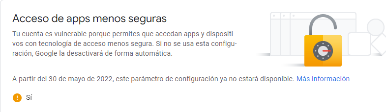
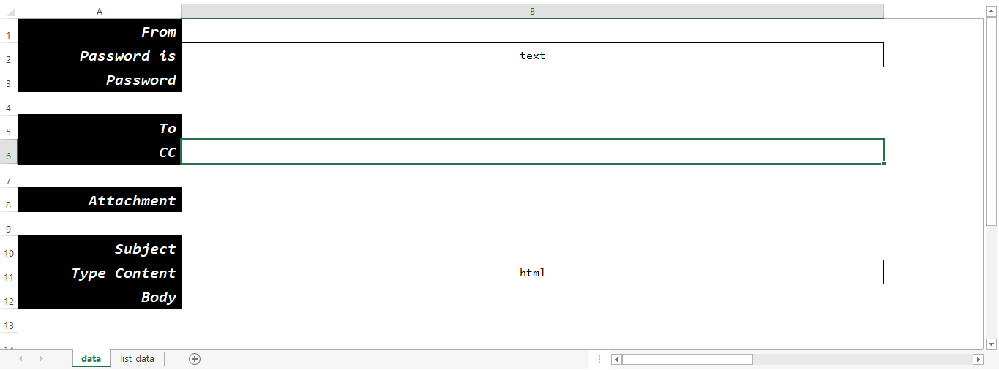

# **Documentacion**
***Py-ersonal Email*** es un proyecto diseniado para la automatizacion de envio
de correos electronicos. 

 

# **Requerimientos**
1. **[Python 3.6 en adelante (recomendado 3.9)](https://www.python.org/downloads/)**
2. En la cuenta de email donde seran enviados los correos debe de cambiarse la configuracion de ___Acceso de apps menos seguras___:

3. Tener instalado: 
    - **[Office](https://www.microsoft.com/es-mx/)**
    o
    - **[LIbreOffice](https://www.libreoffice.org/discover/libreoffice/)**

 

# **Extensiones**
Para usar este proyecto es necesario tener las siguientes extensiones:
- **[pip install openpyxl](https://pypi.org/project/openpyxl/)**
- **[pip install secure-smtplib](https://pypi.org/project/secure-smtplib/)**
- **[pip install cryptocode](https://pypi.org/project/cryptocode/)**

Adicional a las extensiones, el archivo **[ExcelLibrary.py](https://github.com/peterservice-rnd/robotframework-excellib)** ubicado en **libraries**, es una libreria diseniada para **[RobotFramework](https://robotframework.org/)** que fue reutilizada en este proyecto.

 

# **Inicio**
En este apartado se explicara como usar este proyecto.

## **Almacenamiento de archivos**
Los archivos que seran utilizados como recursos para la estructura del correo como:
- Adjuntos.
- Archivos con el cuerpo del correo.

Deben ser ubicados en la carpeta **resources** y de ahi se pueden especificar en el layout de datos.

## **Datos del correo**
Los datos que contienen la informacion del correo se encuentra en la carpeta ***data*** ubicada en la carpeta del proyecto.
El nombre del archivo es ***data.xlsx***. 
En este archivo hay una pestania que se llama ***data***, esta misma tiene la siguiente estructura:

1. **From:**
    - Es la cuenta donde seran enviados los correos

1. **Password is:**
    - Es una lista de datos que contiene el tipo de contrasenia que se esta ingresando, las opciones son las siguientes:
        - _encrypted:_ Si la contrasenia esta encriptada (funciona con el modulo cryptocode de python).
        - _text:_ Si la contrasenia se encuentra en texto plano.

1. **Password:** 
    - Es la contrasenia de la cuenta de correo.

1. **To:** 
    - Son los destinatarios.
        - _Nota:_ Si se enviara el correo a mas de una persona pueden agregarse las direcciones de correo de forma vertical

1. **CC:** 
    - Son los destinatarios que seran copiados en el correo.
        - _Nota:_ Esta opcion aun no se encuentra habilitada por detalles tecnicos.

1. **Attachment:** 
    - Son los archivos que seran adjuntados en el correo electronico.     
        - _Nota:_ Si se adjuntara mas de un archivo al correo pueden agregarse de forma vertical.

1. **Subject:** 
    - Es el titulo del correo.

1. **Type Content:** 
    - Especifica el tipo del cuerpo del correo que sera enviado:
        - _html:_ Cuando el cuerpo del correo viene de un archivo **.html**.
        - _plain:_ Cuando el cuerpo del correo se encuentra en texto plano.

1. **Body:** 
    - Es el cuerpo del correo. Se puede agregar de 2 formas:
        - **Por nombre de archivo:** Se especifica el nombre del archivo que contiene el cuerpo del correo y sera agregado a traves de ahi.
            - _Nota:_ El archivo con el cuerpo del correo se debera guardar en la carpeta resources.

        - **Desde el mismo excel:** Se especifica el cuerpo del correo dentro de la misma linea en el excel.

## **Ejecucion**
Para iniciar el proyecto se debera ejecutar el archivo ***\_\_main\_\_.py***  que esta dentro de la carpeta
***source*** en el proyecto. Dentro de una consola de comandos, hay que posicionarse en la carpeta donde ha 
sido descargado el proyecto y ejecutar el siguiente comando:
<code>
    py \_\_main\_\_.py
</code>

 

# **Recomendaciones**
1. Se recomienda instalar las dependecias de este proyecto en un entorno virtual para evitar conflictos.
<code>
    python -m venv venv_pyersona_email
</code>

 

<code>
    py ./venv_pyersona_email/Scripts/activate
</code>

